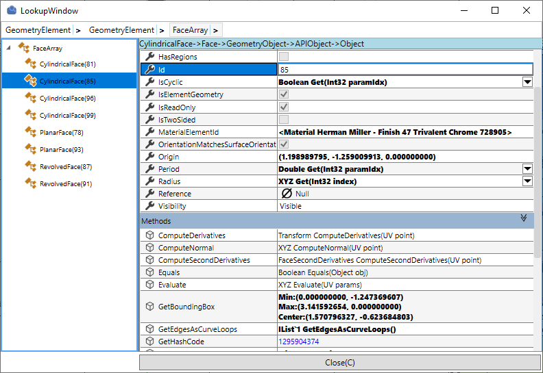
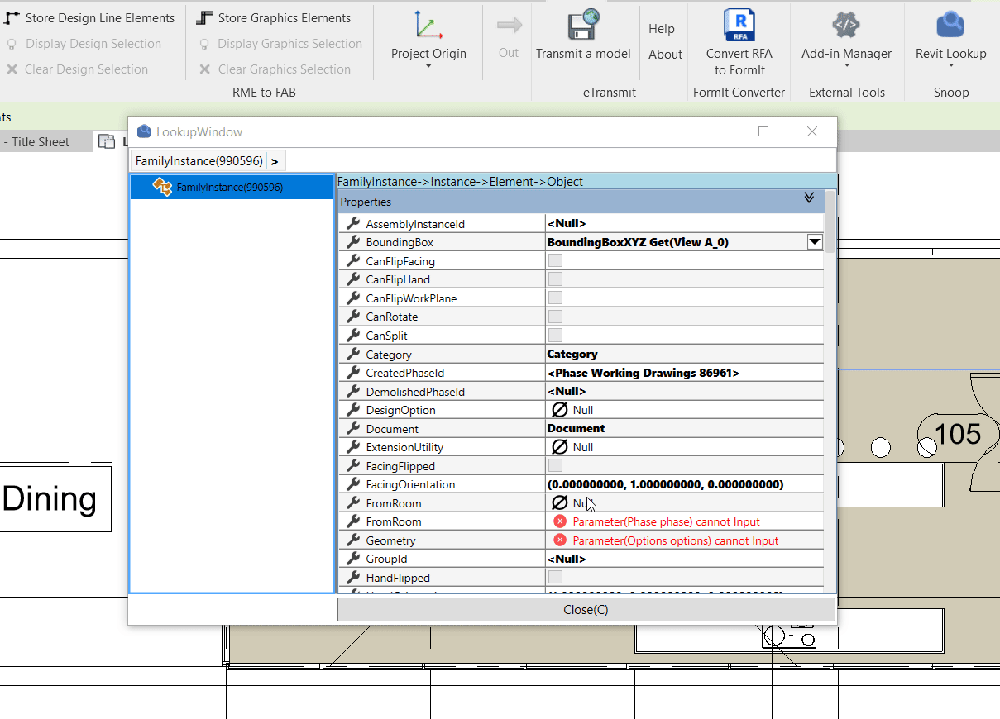
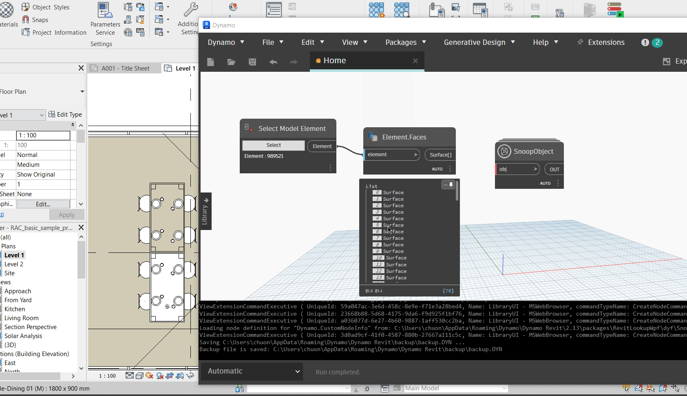
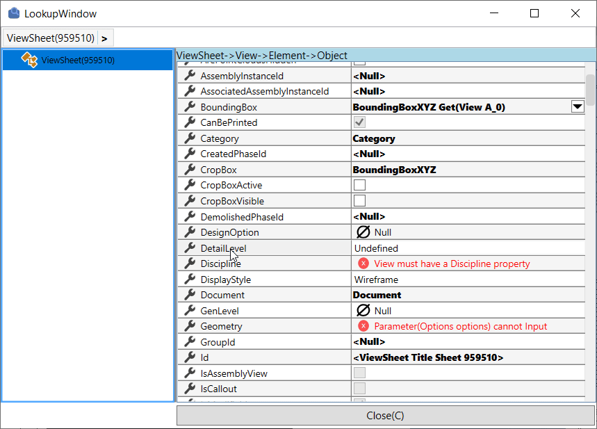
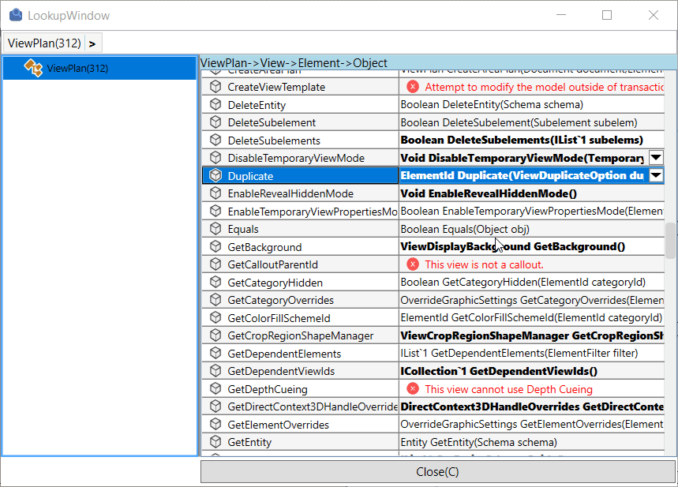

## Revit Lookup WPF

# Introduction

Interactive Revit RFA and RVT project database exploration tool to view and navigate BIM element parameters, properties and relationships.The project was developed to support programmers using Revit API to quickly look up and work efficiently with parameter objects.

The advantage of project RevitLookupWpf is that it allows the user to delve into full methods and properties, which makes it easier for professionals to discover revit's hidden functions.

## Installation

Please follow last release at section [Release](https://github.com/weianweigan/RevitLookupWpf/releases/latest)

**Note:** The release currently supports 5 version Revit : 2019, 2020, 2021, 2022 , 2023

---
### Revit Add-in

With RevitlookupWpf inside, you can use some features like:

- [x] Snoop DB : Explore the database of Revit API.
- [x] Snoop Active Document : Explore the active document of Revit project current.
- [x] Snoop Active View : Explore the active view of Revit project current.
- [x] Snoop Current Selection : Explore the element current selected of Revit project current.
- [x] Snoop Points : Explore the some points by pick select in project.
- [x] Snoop Faces : Explore some faces contains inside Geometry Element.
- [x] Snoop Edges : Explore some edges contains inside Geometry Element.
- [x] Snoop Points On Elements : Explore the points on Element by pick select Points. 
- [x] Snoop Geometry Element  : Explore Geometry Element.
- [x] Snoop Linked Element : Explore all Element inside Revit Linked project.
- [x] Snoop UIApplication : Explore UIApplication Revit project.
- [x] Snoop Search Elements  :Explore all element in document current and linked document by Id. 

### Dynamo Revit Package

Happy to say that RevitLookupWpf also support snoop everything inside inviroment Dynamo Revit. Some feature will be support included:

- [x] Snoop Revit Element (**Dynamo Element** _Wraped_ from **Revit Element**)
- [x] Snoop Current Selection
- [x] Snoop Active Document 
- [x] Snoop Active View
- [x] Snoop Object (Everything objects defined in Dynamo)

**Note** : Please download package **RevitlookupWpf** And package **DynamoIronPython2.7** before starting Snoop in enviroment Dynamo Revit. 

### Advanced

- Allow show help information **Properties** and **Methods** :

- Connect with [RevitAPIDocs](https://www.revitapidocs.com/)

- Set Value input method require input parameters

## Author

Originally implemented by [weianweigan](https://github.com/weianweigan), contribute with [Chuong Ho](https://github.com/chuongmep).

---

## License

This sample is licensed under the terms of the [MIT License](http://opensource.org/licenses/MIT). Please see the [License](License.md) file for full details.

---

## Contribute

**Revit Lookup WPF** is an open-source project and would be nothing without its community. You can make suggestions or track and submit bugs via Github [issues](https://docs.github.com/en/issues/tracking-your-work-with-issues/creating-an-issue). You can submit your own code to the **Revit Lookup WPF** project via a Github [pull request](https://docs.github.com/en/pull-requests/collaborating-with-pull-requests/proposing-changes-to-your-work-with-pull-requests/about-pull-requests).

Many Thanks all contributors for this repository. Feel free to contribute!
Please refer to the [CONTRIBUTING](CONTRIBUTING.md) for details.

---

## Sponsors

Thanks to [JetBrains](https://www.jetbrains.com/) for providing licenses for [Rider](https://www.jetbrains.com/rider/) and [dotUltimate](https://www.jetbrains.com/dotnet/) tools, which both make open-source development a real pleasure!

---
