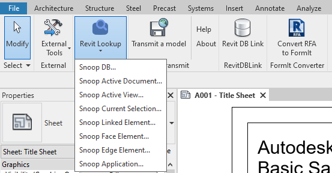

## Revit Lookup WPF

# Introduction

Interactive Revit RFA and RVT project database exploration tool to view and navigate BIM element parameters, properties and relationships.The project was developed to support programmers using RevitAPI to quickly look up and work efficiently with parameter objects.

### Addin

### Window

## Installation

Please follow last release at section [Release](https://github.com/weianweigan/RevitLookupWpf/releases/latest)

**Note:** The release currently supports 4 version Revit : 2019, 2020, 2021, 2022

---
## Build

Debugging:

- Run **Debug Profile** in Visual Studio or **Run Configuration** in JetBrains Rider. The required files have been added. All project files will be automatically copied to the Revit plugins folder.

Creating a package:

- Open the terminal of your IDE.
- Install Nuke global tools `dotnet tool install Nuke.GlobalTool --global`.
- Run `nuke` command.
- The generated package will be in the **output** folder.

For more information on building, see the [**RevitTemplates**](https://github.com/Nice3point/RevitTemplates) Wiki page.

**Note:** The project currently supports 4 version nearest with current year.

Please refer to the [CHANGELOG](CHANGELOG.md) for details.

---

## Author

Originally implemented by [weianweigan](https://github.com/weianweigan), contribute with [Chuong Ho](https://github.com/chuongmep).

---

## License

This sample is licensed under the terms of the [MIT License](http://opensource.org/licenses/MIT). Please see the [License](License.md) file for full details.

---

## Contribute

**Revit Lookup WPF** is an open-source project and would be nothing without its community. You can make suggestions or track and submit bugs via Github [issues](https://docs.github.com/en/issues/tracking-your-work-with-issues/creating-an-issue). You can submit your own code to the **Revit Lookup WPF** project via a Github [pull request](https://docs.github.com/en/pull-requests/collaborating-with-pull-requests/proposing-changes-to-your-work-with-pull-requests/about-pull-requests).

Many Thanks all contributors for this repository. Feel free to contribute!
Please refer to the [CONTRIBUTING](CONTRIBUTING.md) for details.

---

## Sponsors

Thanks to [JetBrains](https://www.jetbrains.com/) for providing licenses for [Rider](https://www.jetbrains.com/rider/) and [dotUltimate](https://www.jetbrains.com/dotnet/) tools, which both make open-source development a real pleasure!

---
